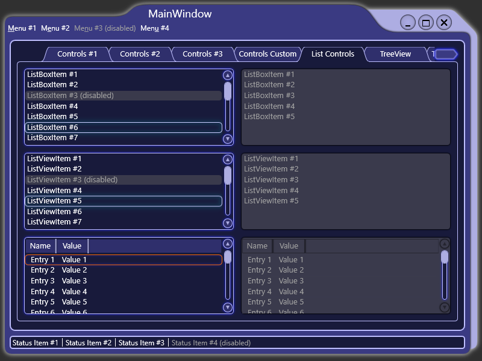
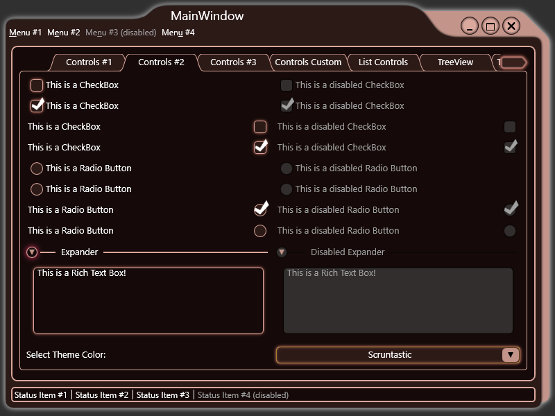

# What's this?
**DukNuk.WPF** is a theme project for .NET WPF controls inspired by the "ShadesOS" GUI from Duke Nukem Forever 2001.

In this initial release, I have customized the templates for most of the standard WPF controls, excluding calendars and toolbars.

## Examples of what it looks like
|                                       |                                        |
|---------------------------------------|----------------------------------------|
|        |         | 
|        |  |
|   |     |

## It comes in different colors too
|                                         |                                          |
|-----------------------------------------|------------------------------------------|
|  |   | 

# How to use it?

You can check out all the controls by cloning this git and running the **DukNukWpfTest** project.

If you want to include the theme in your WPF application, you have two options:

1. Simply include the resource files in your `App.xaml` like so:
```xml
<Application x:Class="DukNuk.Wpf.Test.App"
             xmlns="http://schemas.microsoft.com/winfx/2006/xaml/presentation"
             xmlns:x="http://schemas.microsoft.com/winfx/2006/xaml"
             StartupUri="Views/MainWindow.xaml">
    <Application.Resources>
        <ResourceDictionary>
            <ResourceDictionary.MergedDictionaries>
                <ResourceDictionary Source="pack://application:,,,/DukNukWpf;component/Themes/Generic.xaml" />
                <ResourceDictionary Source="pack://application:,,,/DukNukWpf;component/Themes/ThemeColors/Scruntastic.xaml" />
            </ResourceDictionary.MergedDictionaries>
        </ResourceDictionary>
    </Application.Resources>
</Application>
```
Notice that you can include a custom theme colors resource dictionary after `Generic.xaml` to override the *Default Blue* look.

2. If you want to live-swap theme colors, you can use the [ThemeManager](DukNukWpf/Helpers/ThemeManager.cs) class!

## Using the ThemeManager

### 1. Initializaiton

First you need to initialize the Theme Manager like this:
```csharp
public partial class App : Application {
        protected override void OnStartup(StartupEventArgs e) {
            // NOTE: this needs to be called after the App's InitializeComponent!
            // otherwise the ThemeManager's resource dictionaries will get replaced during initialization...
            ThemeManager.Default.InitializeAppResources("Scruntastic");
            
            //TODO, other startup code here...
        }
    }
```

The Theme Manager loads the theme's resource dictionaries in the App's Resources. Notice that you can pass a specific theme name to load as the initial theme. The theme name must be the same as its corresponding `DukNuk.Theme.Name` string resource value.

NOTE: You can access the global instance of the Theme Manager using `ThemeManager.Default` or you can instance your own and use that throughout the application.

### 2. Loading custom themes
You can of course create your own theme color schemes, simply copy one of the existing .xaml definitions like [DefaultBlue.xaml](DukNukWpf/Themes/ThemeColors/DefaultBlue.xaml), change the colors, then load your custom file using the Theme Manager's `LoadThemeColorsFromFile` method. Make sure to also change the **DukNuk.Theme.Name** resource so you can load your theme. You can also load custom theme resources using one of the other `LoadThemeColors` methods to laod them from an in-memory ResourceDictionary or from an URI.

NOTE: If you want, you can also easily customize certain sizing parameters by overriding resources from [ThemeSizes.xaml](DukNukWpf/Themes/ThemeSizes.xaml) in your theme file.

EXTRA NOTE 1: You can use the `LoadThemeColorsFromDirectory` method to batch load multiple files from an existing directory. This will attempt to load theme resources from any .xaml file that contains a `DukNuk.Theme.Name` resource. In theory, something like this can allow the end-user to define their own Theme Color definitions to use, however there is currently no exception handling for invalid resource files. For such a use case, it may be best to individually load the files yourself and treat exceptions as you see fit. 

EXTRA NOTE 2: While I haven't tested this, you should be able to load additional custom resources into existing themes! Simply use one of the `LoadThemeColors` methods to load a Resource Dictionary that has the same name as an existing theme. All existing keys in the Theme Manager's dictionaries get replaced while new keys get added. This can be useful if you want to switch certain resources like images or something when live-switching theme colors. Or maybe if you want to theme your own custom controls and have their custom resources get changed too.

### 3. Switching theme colors live

First, you can get a list of the available loaded themes by using the `GetAvailableThemeColors` method. This returns a list of theme names that you can load. Example:
```csharp
ThemeManager.Default.GetAvailableThemeColors();
```

Next, simply use the `SetTheme` method to load the resources from the theme of your choice. The theme name must be the same as defined in the theme's `DukNuk.Theme.Name` resource. 
```csharp
ThemeManager.Default.SetTheme(value);
```

### 4. Other info
When one of the current theme's theme resources is changed by loading a new Theme ResourceDictionary the `ThemeResourcesChanged` event gets fired.
More importantly, the Theme Manager implements `INotifyPropertyChanged` and `INotifyPropertyChanging`. They get fired when using the `SetTheme` method to change the `CurrentTheme`. 


